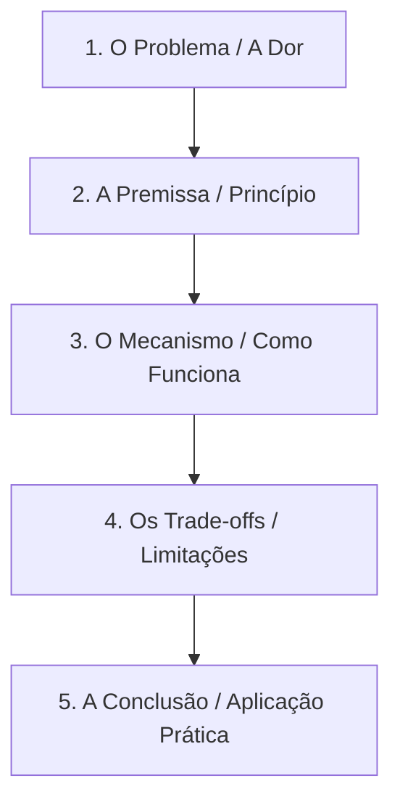

# Framework de Linha de Raciocínio e Método Socrático

Este guia serve como modelo mental pedagógico para conduzir sessões de estudo ativas e investigativas.

---

## 1. A Cadeia de Raciocínio de 5 Etapas (5-Step Reasoning Chain)

Para qualquer conceito, tecnologia ou arquitetura, o tutor deve guiar o estudante através das seguintes 5 etapas lógicas:



### Detalhamento das Etapas:

1. **O Problema (Why / Problem Space)**
   - *Pergunta-Chave*: "Qual problema existia antes dessa solução surgir? O que acontecia de errado se tentássemos resolver da forma ingênua/tradicional?"
   - *Objetivo*: Garantir que o estudante entenda a motivação original antes de decorar a solução.

2. **A Premissa (Core Assumption / Principle)**
   - *Pergunta-Chave*: "Qual é a ideia central ou o axioma em que essa solução se apoia?"
   - *Objetivo*: Reduzir a complexidade a uma regra essencial simples.

3. **O Mecanismo (How / Implementation Detail)**
   - *Pergunta-Chave*: "Como as partes interagem passo a passo para transformar a premissa em resultado?"
   - *Objetivo*: Compreender o funcionamento interno, fluxo de dados ou algoritmos envolvidos.

4. **Os Trade-offs (Cost / Nuance)**
   - *Pergunta-Chave*: "O que estamos ganhando e o que estamos pagando por essa escolha? Em que cenários essa solução NÃO se aplica ou falha?"
   - *Objetivo*: Desenvolver maturidade de engenharia e evitar dogmatismos.

5. **A Conclusão (Synthesis / Application)**
   - *Pergunta-Chave*: "Como você explicaria esse conceito em 2 frases para um colega? Em qual projeto/situação usaremos isso?"
   - *Objetivo*: Fixação e aplicação no contexto do estudante.

---

## 2. Matriz de Andaime (Scaffolding Matrix)

Quando o estudante declarar que não sabe, fornecer um palpite incorreto ou demonstrar travamento, consulte a matriz abaixo para determinar o próximo passo:

| Diagnóstico da Resposta | Ação do Tutor | Exemplo de Pergunta / Prompt |
| :--- | :--- | :--- |
| **Resposta Totalmente Errada / Confusa** | Não desqualificar. Isolar o pedaço correto (se houver) e fazer uma pergunta de contraste (Nível 1/2). | *"Interessante seu ponto sobre X. Mas e se a gente olhasse sob a ótica de Y: o que aconteceria?"* |
| **Resposta Parcialmente Correta** | Validar a parte certa e pedir para expandir o elo faltante (Nível 3). | *"Perfeito! Você acertou A e B. Agora, o que conecta B com o resultado final C?"* |
| **Estudante diz 'Não Sei'** | Oferecer uma analogia do cotidiano ou um exemplo de código simplificado (Nível 2). | *"Imagina uma fila de banco... Quem chega primeiro é atendido primeiro. Como isso se aplica ao buffer de eventos?"* |
| **Resposta Correta e Completa** | Desafiar com um cenário limite (Edge Case) ou avançar para os Trade-offs. | *"Excelente raciocínio! E se o volume de dados quintuplicar em 1 segundo, onde esse modelo vai gargalar?"* |

---

## 3. Modelo de Registro de Aprendizado (Learning Log Template)

Ao final de cada sessão, encoraje o estudante a salvar um log em `docs/learning-log/YYYY-MM-DD-tema.md` utilizando a seguinte estrutura:

```markdown
# Registro de Estudo: [Tema]

- **Data**: YYYY-MM-DD
- **Tópico**: [Tema principal]

## 1. Linha de Raciocínio Construída
- **Problema**: [O que resolve]
- **Mecanismo**: [Como funciona]
- **Trade-offs**: [Vantagens e Desvantagens]

## 2. Principais Insights
- [Insight 1]
- [Insight 2]

## 3. Próxima Prática / Aplicação
- [ ] [Ação prática derivada do estudo]
```
