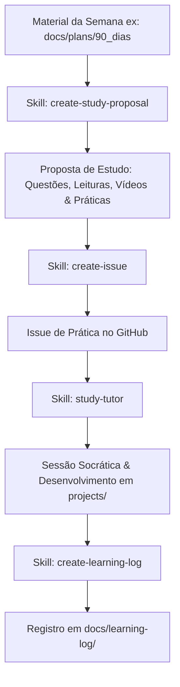

# Guias e Instruções do Repositório (`AGENTS.md`)

Este arquivo estabelece as convenções, o fluxo de trabalho e o ecossistema de habilidades para qualquer agente de IA atuando neste repositório.

---

## 1. Visão Geral do Projeto

Este repositório é dedicado à execução prática, estudo e evidências técnicas em **Engenharia de Software**, **Domain-Driven Design (DDD)**, **Specification-Driven Development (SDD)** e **Harness Engineering**.

### Estrutura do Repositório

- `docs/`: Registros técnicos, especificações (`docs/specs/`), planos de estudo (`docs/plans/`), resumos (`docs/harness/`) e registros de aprendizado (`docs/learning-log/`).
- `projects/`: Aplicações, protótipos e práticas executáveis em código.
- `templates/`: Modelos reutilizáveis de specs, READMEs e logs.
- `.agents/skills/`: Skills de projeto para automação de fluxos de estudo e documentação.
- `.github/`: Templates de issues e configurações de fluxo.

---

## 2. Fluxo Semanal de Estudo & Desenvolvimento

Todo estudo de conteúdo semanal deve seguir o fluxo integrado abaixo:

1. **Seleção do Material**: Escolher a semana/tópico alvo em `docs/plans/`.
2. **Proposta de Estudo (`create-study-proposal`)**: Gerar a estrutura com objetivos, questões reflexivas, leituras/artigos, vídeos e propostas de projetos hands-on.
3. **Criação da Issue (`create-issue`)**: Converter a prática escolhida em uma issue no GitHub (`practice: <titulo>`).
4. **Tutoria Socrática (`study-tutor`)**: Conduzir discussões investigativas (dor -> mecanismo -> trade-offs) sem entregar respostas prontas.
5. **Implementação (`projects/`)**: Desenvolver a solução prática com suíte de validação/testes.
6. **Registro (`create-learning-log`)**: Documentar o que foi feito, aprendizados e evidências em `docs/learning-log/`.

---

## 3. Ecossistema de Skills Disponíveis

Ao receber solicitações do usuário, utilize e sugira as skills apropriadas localizadas em `.agents/skills/`:

| Skill | Quando Utilizar |
| :--- | :--- |
| `create-study-proposal` | Quando o usuário passar um material/semana de estudo (ex: `docs/plans/90_dias_Engenharia_de_software.md`) para gerar questões, vídeos, artigos e exercícios. |
| `study-tutor` | Quando o usuário quiser discutir um tema, responder às questões reflexivas, tirar dúvidas conceituais ou praticar via tutoria socrática. |
| `create-issue` | Quando o usuário definir uma prática a ser feita e for necessário abrir uma issue estruturada no GitHub. |
| `create-learning-log` | Quando uma prática for concluída e o aprendizado/evidências precisarem ser registrados em `docs/learning-log/`. |
| `create-spec` | Quando uma prática exigir uma especificação técnica prévia em `docs/specs/`. |
| `create-project-readme` | Quando for criado um novo subprojeto dentro da pasta `projects/`. |

---

## 4. Segurança, Privacidade e Restrições

> [!CAUTION]
> **Privacidade Absoluta**
> NUNCA registre ou permita a inclusão de: credenciais, dados pessoais identificáveis, documentos internos, segredos de acesso ou dados reais de Cartório. Utilize estritamente dados sintéticos ou genéricos em todos os códigos, issues e registros.
